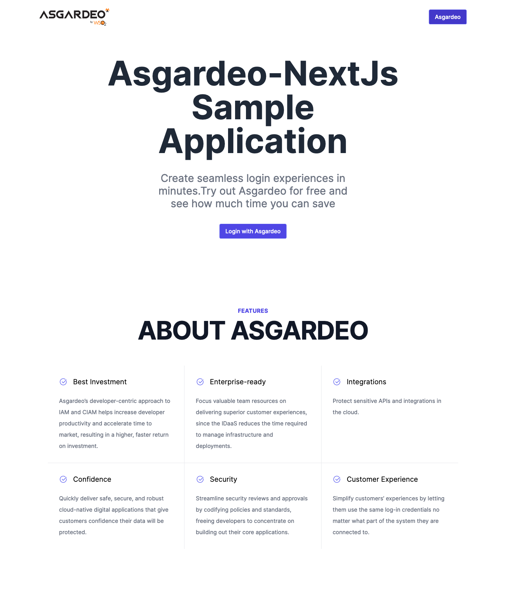

<p align="center">
  
</p>

## 🚀 Getting started

Clone this repository and do the following inside the project folder:

1. Run `cp .env.local.example .env.local`
2. Enter the Asgardeo configuration values to the respective fields in `.env.local`
      ```
      ASGARDEO_CLIENT_ID=
      ASGARDEO_CLIENT_SECRET=
      ASGARDEO_SCOPES=
      ASGARDEO_ORGANIZATION_NAME=
      ```
3. Run `yarn`
4. Run `yarn dev`

To view the project open `http://localhost:3000`

## 📝 License

This project is licensed under the MIT License - see the [LICENSE.md](LICENSE.md) file for more information.
